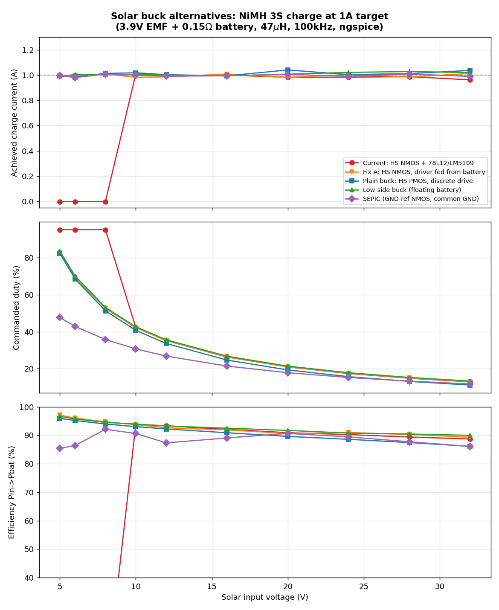

# Solar buck topology exploration - findings report

Date: 2026-07-04
Tooling: ngspice-42 via the ngspice MCP server (`~/ngspice/mcp/ngspice-mcp`), netlists and
sweep driver in [sim-topologies/](sim-topologies/).

## TL;DR

The current converter is topologically fine - it fails below ~12 V in only because the
**gate-drive supply chain** (78L12 fed from solar -> LM5109B) collapses, not because the
buck itself cannot run there. Simulation confirms the power stage charges at full current
from 10 V down to 5 V input the moment the gate rail is decoupled from the solar input.

Ranked findings (1 A charge into 3S NiMH, 3.9 V EMF + 0.15 ohm, 47 uH, 100 kHz):

1. **Low-side buck (your preference) works and is the simplest power path** - full 1 A at
   Vin = 5 V, 93-97 % efficiency, gate driven *directly from a 3.3 V MCU pin*, no driver
   IC, no aux rail, no bootstrap. The catch is architectural, not electrical: the battery
   no longer shares ground with the panel, which changes battery sensing and the night-time
   return path. All the consequences are workable (details in section 5) but they touch
   more of the schematic than the converter itself.
2. **Minimal-change fix: keep the existing high-side NMOS stage, feed the LM5109 VDD from
   the battery instead of the solar rail** (tiny SOT-23 boost 3.6-4.2 V -> ~9 V). Best
   simulated efficiency of all options (96-97 % at low Vin), works to 5 V in, and only
   replaces U6's input connection - the rest of the board stays as-is.
3. **Plain buck with a high-side PMOS** and a discrete 3-transistor level shifter: works
   5-32 V with no aux rail and no driver IC, ~1-4 % lower efficiency than the NMOS
   versions at high Vin (PMOS Rds + drive losses).
4. **SEPIC** - the only way to get a ground-referenced NMOS *and* common ground: works,
   but costs a second inductor and 3-8 % efficiency; only worth it if you also want to
   harvest below battery voltage.

Recommendation at the end (section 7).

## 1. Why the current design will not work below ~12 V

Chain on the board: `Solar In` -> U6 (AS78L12, 12 V LDO) -> U5 (LM5109BMA) -> Q1
(CSD18540Q5B, high-side NMOS) via bootstrap.

Three stacked constraints:

| Element | Constraint | Effect as solar sags |
|---|---|---|
| AS78L12 | ~1.7 V dropout, so regulation only above ~13.7 V in | Below that, VDD = Vin - 1.7 V and falls with the panel |
| LM5109B | UVLO ~6.7 V rising (recommended VDD 8-14 V) | Gate drive dies entirely around Vin = 8.5-9 V |
| CSD18540 + bootstrap | Vgs = VDD - 0.7 V | Between ~9 and ~14 V in, Q1 gets progressively weaker enhancement; Rds rises just when the panel is already weak |

There is also a soft-failure mechanism that makes the practical limit ~12-14 V rather
than the theoretical ~9 V: when the panel sags under load, VDD sags, Rds(on) rises, the
stage drops more voltage, the panel is pulled down further - a collapse loop. And because
the LM5109 is bootstrapped, duty cycle can never reach 100 %, so the stage always needs
Vin comfortably above Vbat even with a healthy gate rail.

Simulated baseline (gate rail modeled as min(12, Vin-1.7) with 6.9 V UVLO): dead at 5, 6
and 8 V in (Vgs = 0, zero charge current); wakes up at 10 V with Vgs = 7.6 V. Full table
in section 8.

For a forest deployment this matters a lot: a shaded/low-sun panel spends much of the day
in exactly the 5-12 V band the current design throws away.

## 2. Method

- ngspice driven through the MCP server over stdio (`sim-topologies/mcp_ngspice.py`).
- Load: 3S NiMH modeled as 3.9 V EMF + 0.15 ohm internal resistance. For each topology and
  each Vin in {5, 6, 8, 10, 12, 16, 20, 24, 28, 32} V, a bisection search finds the duty
  that delivers 1.0 A charge current; efficiency = P(battery terminal) / P(input source).
- Shared parts models (`sim-topologies/common.inc`): VDMOS power FETs (CSD18540-class NMOS,
  40-60 V PMOS ~35 mohm, logic-level NMOS ~AO3400 class), SS56 Schottky, 47 uH / 38 mohm
  inductor, 100 kHz. Panel modeled as a stiff source (MPPT dynamics out of scope; all
  MCU-PWM options keep duty control, so your MPPT loop carries over unchanged).
- Async (diode) rectification everywhere, matching the current SS56 design. Note the diode
  costs ~8-10 % efficiency at 4 V out regardless of topology; synchronous rectification is
  the single biggest efficiency lever if you ever want it.

Caveats: switch/driver models are class-approximations, not vendor models; gate-drive
losses for the MCU-driven options are drawn from ideal sources (real cost ~10-20 mW);
efficiencies are best read as *relative* numbers between topologies.

## 3. Option A (minimal change): keep HS NMOS, feed the driver from the battery

Replace the solar-fed 78L12 with a small boost/charge pump from +BATT to ~9 V for the
LM5109 VDD (e.g. any SOT-23 boost at a few mA, or a 2-stage charge pump; LM5109 gate load
at 100 kHz is only ~10-15 mA).

```
  before:  Solar In -> 78L12 -> LM5109 VDD     (dies with the panel)
  after:   +BATT (3.6-4.2 V) -> tiny boost 9 V -> LM5109 VDD   (always alive)
```

- Simulated: full 1 A at Vin = 5 V, 97.1 % efficiency (best of all options), Vgs = 8.3 V
  independent of Vin.
- Bootstrap still caps duty at ~95 %, so minimum usable panel voltage is ~4.6-5 V -
  in practice the same floor as the other options at this battery voltage.
- Driver boost draws from the battery even while charging; at ~15 mA * 9 V = 135 mW gate
  budget this is negligible against the 4 W being charged, and it can be enabled only when
  the panel is present (MCU controls it via VSENSE_VIN).
- Schematic delta: U6 replaced by a boost, one enable line. Q1, U5, D3, L2, sensing - all
  unchanged.

## 4. Option B: plain buck, high-side PMOS, discrete drive

```
                +--------------- Vin (panel)
                |  S
              [PMOS]  G --+-- Rgs 10k to Vin
                |  D      |
   SW node -----+      [driver]
    |                     |
   [SS56 to GND]       2N7002 level shift (node A, 2.2k pull-up to Vin)
    |                  + NPN/PNP emitter follower
   [L 47u]             PNP collector tied to a zener rail (Vin - 10 V)
    |                  so Vgs is clamped to -10 V at high Vin
   Battery 3S NiMH     and swings to -Vin when Vin < 10 V
```

- MCU PWM (3.3 V) drives the 2N7002 directly: no driver IC, no aux LDO, no bootstrap.
- Works over the full 5-32 V range; Vgs self-scales: -4.2 V at 6 V in, -8.3 V at 16 V in,
  -10 V (clamped) at 24-32 V in.
- 100 % duty allowed -> panel can be passed straight through to the battery at dawn/dusk.
- Efficiency simulated 90-96 %: roughly 1-3 points below the NMOS options at mid/high Vin
  (higher PMOS Rds, level-shifter bleed ~50-150 mW at 32 V).
- Gate-drive subtleties found in simulation (worth keeping for the real design):
  - the follower's PNP collector must tie to the zener rail (that is what clamps Vgs);
    a plain clamp diode on the level-shift node dumps amps through the zener - the first
    sim attempt lost 25+ points of efficiency to exactly that;
  - a base resistor (~2.2k) is required to bound PNP base current when the shifter sits low.
- Parts: PMOS 40-60 V with Rds spec at Vgs = -4.5 V (e.g. SQ/AO/Vishay 40-60 V pFETs),
  2N7002, BC846/BC856 pair, 10 V zener, 4 R, 1 C.

## 5. Option C (preferred): low-side buck - works, with one architectural catch

Power stage (this is the LED-driver "inverse buck" arranged for battery charge):

```
   Vin rail (panel+) ----+----------------+
                         |                |
                      [Battery]        [SS56]  (freewheel, SW -> Vin)
                      bat+ top           |
                      bat- = node X      |
                         |               |
                       [L 47u]           |
                         |               |
                 SW -----+---------------+
                         |
                      [NMOS]  D=SW, S=GND(panel-), G <- MCU PWM pin, direct
                         |
   GND (panel-) ---------+
```

ON: panel -> battery -> L -> FET -> back (battery charges, L energizes).
OFF: L freewheels through SS56 *through the battery* - charge current is continuous.

Simulated results are the best of the "no aux rail" options:

- Full 1 A at Vin = 5 V (duty 83 %), 96.6 % efficiency there, 93-95 % across the range.
- Gate is ground-referenced: **driven directly from the 3.3 V MCU pin through ~30 ohm**
  in the sim - genuinely zero driver components. This is the "low threshold" win you
  wanted: there is no minimum Vin from the drive at all; the floor is just Vbat + resistive
  drops (~4.5 V for 1 A, lower for reduced current).
- 100 % duty = panel connected straight across battery through L and a saturated FET
  (no diode drop) - ideal dawn/dusk behavior.

**The catch: the battery no longer shares ground with the panel/MCU.** bat+ sits on the
Vin rail and bat- floats at Vin - Vbat above ground. Since this same battery powers the
MCU, the consequences have to be engineered:

1. *Night / startup return path*: with the FET off, system return current (GND -> bat-)
   flows through the FET body diode -> SW -> L -> bat-. It works unpowered (so the node
   boots), costs ~0.6 V * I_sys; once the MCU is up it can hold the gate high at night,
   turning the drop to ~0. This is self-bootstrapping but must be understood and tested.
   A Schottky from GND to X makes the path explicit and robust.
2. *Battery voltage sense*: Vbat = V(Vin rail) - V(X); needs two dividers and subtraction
   in firmware (or a high-CM-voltage monitor), instead of today's single divider.
3. *Charge current sense*: today's R1 (50 mohm at battery-) no longer sits at GND. Options:
   shunt in the FET source (GND-referenced, reads I_L * D, needs on-time sampling or
   RC + divide-by-D in firmware) or a high-common-mode sense amp (INA282-class) in the
   battery leg.
4. *USB / barrel-jack power paths* (J1/J5, D12/D13 diode-OR into +BATT) are ground
   referenced and interact with the floating battery: charging from USB would return
   through the same body-diode path. Needs a deliberate look at every path touching +BATT.
5. *FET selection*: gate swing is only 3.3 V, and the FET blocks the full panel Voc when
   off (TVS clamps at 43 V). You need a 40-60 V NMOS with Rds characterized at
   Vgs = 2.5-3 V. They exist but the selection is thinner than for 4.5 V-spec parts; the
   alternative is a tiny 1-gate driver or BJT buffer running from a 5 V-ish aux (which
   partly defeats the simplicity). This is the main BOM risk of the option.

Net: electrically the best low-Vin performer with the fewest power-path parts, but it
converts a gate-drive problem into a system-grounding problem. Fine for a from-scratch
respin of the charger section; more invasive than Option A for the current board.

## 6. Option D: SEPIC (ground-referenced NMOS *and* common ground)

For completeness: the only single-switch way to keep panel, battery and MCU on one ground
with a ground-referenced, MCU-driven NMOS is to give up the pure buck (a buck's switch
never touches ground when input and output share it - that is exactly why high-side drive
exists). SEPIC does it with a second inductor and a coupling cap:

```
  Vin -> L1 -> SW -> Cc -> node B -> D -> Vout(battery, GND-referenced)
               |            |
             [NMOS]       [L2]
               |            |
              GND          GND
```

- Simulated: works 5-32 V (and would work below Vbat too - unique to this option),
  85-92 % efficiency: the coupling-cap path and second inductor cost a real 3-8 points
  vs the bucks.
- FET and diode see Vin + Vout (~37 V at 32 V in) - 60 V parts still fine.
- Two 47 uH inductors (or one coupled), plus a 10 uF+ AC-rated coupling cap.

Worth choosing only if sub-4 V harvesting matters; otherwise the bucks beat it.

## 7. Comparison and recommendation

| Option | 1 A floor (sim) | Gate drive | Aux rail | Battery grounding | Eff @ 5-12 V | Eff @ 24-32 V | 100 % duty |
|---|---|---|---|---|---|---|---|
| Current (HS NMOS, solar-fed 78L12 + LM5109) | 10 V sim, ~12-14 V on real panel | bootstrap driver IC | 12 V LDO from solar | common GND | dead below 10 V, then 93-94 % | 89-90 % | no (~95 % max) |
| A: HS NMOS, driver rail from battery | 5 V | bootstrap driver IC (unchanged) | ~9 V boost from +BATT | common GND | 94-97 % | 89-91 % | no (~95 % max) |
| B: plain buck, HS PMOS | 5 V | discrete 3-transistor shifter | none | common GND | 92-96 % | 86-89 % | yes |
| C: low-side buck (preferred) | 5 V | MCU 3.3 V pin, direct | none | battery floats (see 5) | 93-97 % | 90-91 % | yes |
| D: SEPIC | 5 V (also works below Vbat) | MCU 3.3 V pin, direct | none | common GND | 85-91 % | 86-88 % | n/a |




### Recommendation

- If you want the **least redesign on this board**: Option A. Delete the 78L12, add a
  SOT-23 boost from +BATT to ~9 V for the LM5109. Everything else (Q1, D3, L2, R1 shunt,
  sensing, firmware) stays. Simulated to charge at full current from 5 V panel input at
  97 % efficiency.
- If you are **respinning the charger section anyway and want minimum parts**: Option C
  (your preferred low-side buck) is validated and excellent electrically - budget the
  redesign time for the five integration items in section 5 (especially battery sensing
  and the 3.3 V-gate FET selection).
- Option B (PMOS plain buck) is the middle ground: conventional grounding, no aux rail,
  slightly worse efficiency; pick it if you want a "plain buck" with the fewest surprises
  and do not mind ~10 extra small components of gate drive.

### Reproducing

```
cd sim-topologies
python3 sweep.py lowside_buck 5 6 8 10 12 16 20 24 28 32   # or hs_nmos / pmos_buck / sepic
python3 plot_topologies.py .
```

`mcp_ngspice.py` talks to the ngspice MCP server binary over stdio JSON-RPC
(`~/ngspice/mcp/ngspice-mcp/ngspice-mcp`), same engine the interactive exploration used.

## 8. Full sweep results

### Current design (HS NMOS, 78L12+LM5109 from solar)

| Vin (V) | Duty (%) | Ichg (A) | Pin (W) | Pbat (W) | Eff (%) | Vgs drive (V) |
|---|---|---|---|---|---|---|
| 5 | - | **0 (dead)** | - | - | - | 0.0 |
| 6 | - | **0 (dead)** | - | - | - | 0.0 |
| 8 | - | **0 (dead)** | - | - | - | -0.0 |
| 10 | 42.2 | 1.01 | 4.36 | 4.09 | 93.8 | 7.6 |
| 12 | 35.2 | 1.00 | 4.32 | 4.03 | 93.3 | 9.6 |
| 16 | 26.3 | 1.00 | 4.40 | 4.05 | 92.1 | 11.3 |
| 20 | 21.0 | 0.98 | 4.37 | 3.97 | 90.9 | 11.3 |
| 24 | 17.4 | 0.98 | 4.41 | 3.98 | 90.2 | 11.3 |
| 28 | 14.9 | 0.99 | 4.47 | 4.00 | 89.4 | 11.3 |
| 32 | 12.9 | 0.96 | 4.39 | 3.89 | 88.7 | 11.3 |

### Fix A: same HS NMOS, driver rail boosted from battery

| Vin (V) | Duty (%) | Ichg (A) | Pin (W) | Pbat (W) | Eff (%) | Vgs drive (V) |
|---|---|---|---|---|---|---|
| 5 | 82.5 | 0.99 | 4.12 | 4.00 | 97.1 | 8.3 |
| 6 | 69.3 | 0.99 | 4.19 | 4.03 | 96.1 | 8.3 |
| 8 | 52.5 | 1.01 | 4.31 | 4.09 | 94.7 | 8.3 |
| 10 | 42.1 | 0.98 | 4.24 | 3.97 | 93.8 | 8.3 |
| 12 | 35.2 | 0.99 | 4.30 | 3.99 | 92.6 | 8.3 |
| 16 | 26.5 | 1.01 | 4.44 | 4.08 | 91.9 | 8.3 |
| 20 | 21.1 | 0.98 | 4.38 | 3.97 | 90.6 | 8.3 |
| 24 | 17.6 | 1.00 | 4.47 | 4.07 | 91.0 | 8.3 |
| 28 | 15.0 | 0.98 | 4.41 | 3.98 | 90.3 | 8.3 |
| 32 | 13.1 | 1.01 | 4.59 | 4.10 | 89.4 | 8.3 |

### Plain buck: HS PMOS + discrete level shift

| Vin (V) | Duty (%) | Ichg (A) | Pin (W) | Pbat (W) | Eff (%) | Vgs drive (V) |
|---|---|---|---|---|---|---|
| 5 | 82.3 | 0.99 | 4.20 | 4.02 | 95.9 | -3.4 |
| 6 | 68.5 | 0.98 | 4.18 | 3.98 | 95.2 | -4.1 |
| 8 | 51.3 | 1.01 | 4.37 | 4.10 | 94.0 | -5.6 |
| 10 | 40.7 | 1.02 | 4.43 | 4.12 | 93.1 | -7.0 |
| 12 | 33.6 | 1.00 | 4.40 | 4.06 | 92.2 | -7.5 |
| 16 | 24.7 | 0.99 | 4.43 | 4.02 | 90.9 | -8.3 |
| 20 | 19.4 | 1.04 | 4.71 | 4.22 | 89.6 | -9.0 |
| 24 | 15.7 | 1.00 | 4.59 | 4.06 | 88.6 | -9.5 |
| 28 | 13.2 | 1.01 | 4.68 | 4.10 | 87.5 | -9.9 |
| 32 | 11.2 | 1.04 | 4.88 | 4.20 | 86.1 | -9.9 |

### Low-side buck: GND-ref NMOS, floating battery

| Vin (V) | Duty (%) | Ichg (A) | Pin (W) | Pbat (W) | Eff (%) | Vgs drive (V) |
|---|---|---|---|---|---|---|
| 5 | 83.5 | 0.99 | 4.16 | 4.02 | 96.6 | 3.3 |
| 6 | 70.1 | 1.00 | 4.24 | 4.06 | 95.7 | 3.3 |
| 8 | 53.1 | 1.00 | 4.30 | 4.06 | 94.5 | 3.3 |
| 10 | 42.6 | 1.00 | 4.32 | 4.06 | 93.9 | 3.3 |
| 12 | 35.6 | 1.00 | 4.34 | 4.05 | 93.3 | 3.3 |
| 16 | 26.8 | 0.99 | 4.35 | 4.02 | 92.5 | 3.3 |
| 20 | 21.4 | 1.01 | 4.45 | 4.08 | 91.7 | 3.3 |
| 24 | 17.9 | 1.02 | 4.56 | 4.14 | 90.8 | 3.3 |
| 28 | 15.3 | 1.03 | 4.61 | 4.17 | 90.5 | 3.3 |
| 32 | 13.4 | 1.02 | 4.59 | 4.13 | 90.0 | 3.3 |

### SEPIC: GND-ref NMOS, common ground

| Vin (V) | Duty (%) | Ichg (A) | Pin (W) | Pbat (W) | Eff (%) | Vgs drive (V) |
|---|---|---|---|---|---|---|
| 5 | 47.6 | 1.00 | 4.73 | 4.04 | 85.5 | 3.3 |
| 6 | 42.9 | 0.98 | 4.59 | 3.97 | 86.4 | 3.3 |
| 8 | 35.8 | 1.01 | 4.43 | 4.08 | 92.1 | 3.3 |
| 10 | 30.7 | 1.00 | 4.47 | 4.05 | 90.6 | 3.3 |
| 12 | 26.8 | 0.99 | 4.60 | 4.02 | 87.3 | 3.3 |
| 16 | 21.5 | 0.99 | 4.52 | 4.02 | 89.1 | 3.3 |
| 20 | 17.9 | 1.01 | 4.49 | 4.07 | 90.7 | 3.3 |
| 24 | 15.3 | 0.99 | 4.48 | 4.01 | 89.4 | 3.3 |
| 28 | 13.3 | 1.01 | 4.66 | 4.09 | 87.7 | 3.3 |
| 32 | 11.8 | 0.99 | 4.65 | 4.00 | 86.1 | 3.3 |
